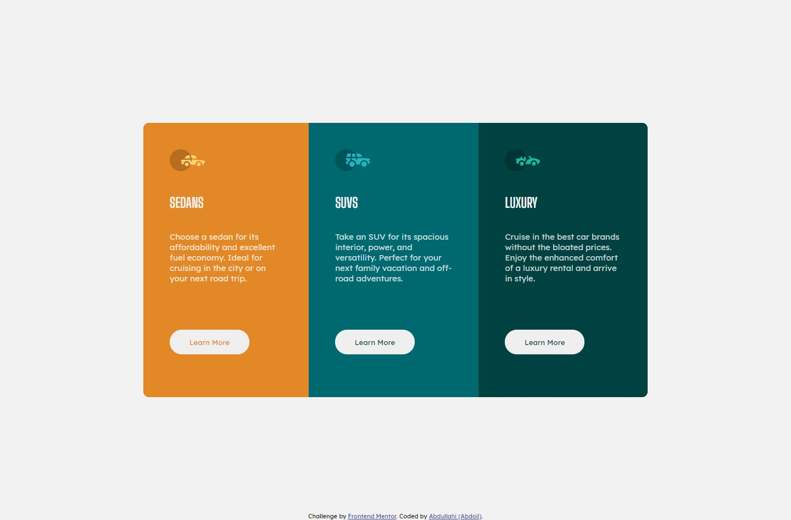

3-column preview card component solution

This is a solution to the [3-column preview card component challenge on Frontend Mentor](https://www.frontendmentor.io/challenges/3column-preview-card-component-pH92eAR2-)

## Overview

## Welcome! 👋

Thanks for checking out this front-end coding challenge.

### Screenshot

## The challenge

- View the optimal layout depending on their device's screen size
- See hover states for interactive elements

### Links

- Live Site URL: [Netlify](3-column-preview-challenge.netlify.app)

## My process

### Built with

- Semantic HTML5 markup
- CSS custom properties
- Flexbox

## Author

- Website - [Abdoil](https://www.abdoil.com)
- Frontend Mentor - [@abdoil](https://www.frontendmentor.io/profile/abdoil)
